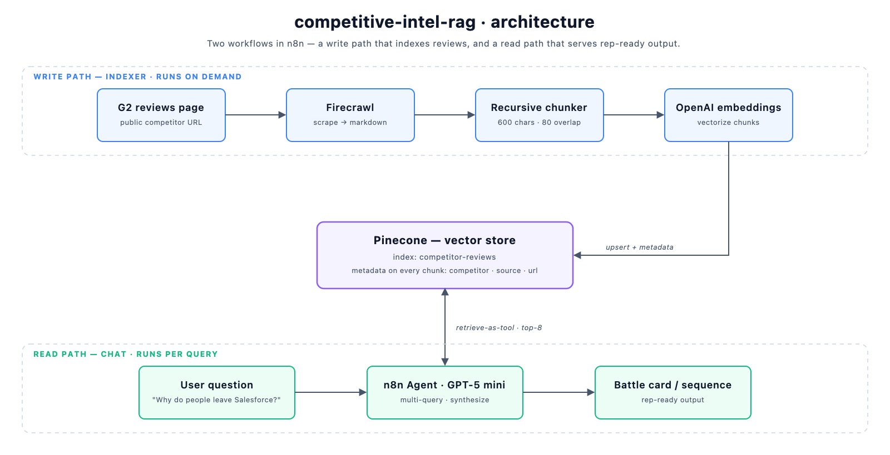

# competitive-intel-rag

A RAG pipeline that turns public G2 reviews into first-draft sales battle cards and competitive outbound sequences — competitive intelligence delivered at the point of work, not in another dashboard.

---

## The problem

Sales teams are surrounded by competitive signal they never use. Every competitor has hundreds of public G2 reviews where real customers say, in their own words, why they're frustrated and why they left. That's the exact language an SDR needs on a cold call — and it's sitting in a format nobody on a revenue team has time to read.

The usual "solution" is a competitive dashboard: someone aggregates the reviews into charts, the charts get a Confluence page, and the page is never opened again. The signal exists; it just never reaches the rep at the moment they're writing the email or handling the objection.

This project takes the opposite stance. The goal isn't to *display* competitive data — it's to **convert unstructured review text into a finished artifact a rep can use immediately**: a battle card or an outbound sequence, generated on demand from a natural-language question like *"Why do people leave Salesforce?"*

Scraping the reviews is the boring part. The interesting part is everything downstream — making messy review text retrievable, and shaping retrieval into output that's usable without editing.

## Architecture

The system is deliberately split into two workflows — a **write path** and a **read path** — because they have completely different runtime profiles and failure modes.

- **Indexer (write path)** — runs occasionally, is allowed to be slow, and is where scraping/chunking/embedding cost lives. See [`workflow/g2-review-indexer.json`](workflow/g2-review-indexer.json).
- **Chat (read path)** — runs on every user query, must be fast, and only ever *reads* the vector store. See [`workflow/competitor-intel-chat.json`](workflow/competitor-intel-chat.json).

Keeping ingestion out of the query path means a slow or failed scrape can never degrade a live battle-card request, and I can re-index on its own schedule without touching the serving layer.

### Why these design choices

**Why a vector store at all, instead of stuffing reviews into the prompt?**
G2 review pages are far larger than any sensible context window, mostly redundant, and only a fraction is relevant to a given question. Embedding + retrieval lets me pull the 8 most semantically relevant chunks for *this* query instead of paying for (and diluting the model with) the entire review corpus. It also keeps the system extensible: adding a second competitor or a second source is just more vectors, not a bigger prompt.

**Why these chunking decisions (600 chars / 80 overlap)?**
Reviews are short, self-contained complaints — a 600-character chunk is large enough to keep one reviewer's point intact but small enough that a retrieved chunk is mostly signal, not filler. The 80-character overlap (~13%) keeps a thought from being split clean across a boundary and lost. Bigger chunks would have retrieved more noise per hit; smaller ones would have fragmented individual complaints.

**Why retrieval-as-tool with multiple searches, instead of one query?**
The chat workflow exposes the vector store to the agent *as a tool*, and the system prompt instructs it to search several times with different angles (`cons`, `switched`, `too expensive`, `support`). A single similarity search biases toward one cluster of phrasing; a battle card needs breadth — cost, adoption, support, and time-to-value are different complaint clusters that won't all surface from one query. Letting the agent issue several searches and synthesize across them produces a more complete card than top-k on a single string ever would.

**Why metadata on every chunk (`competitor`, `source`, `url`)?**
So the output stays auditable and the index stays multi-tenant-ready. Today it's one competitor; with metadata in place, filtering retrieval to a specific competitor (or excluding a source) is a query-time filter, not a re-index.

**Why structure the output as a battle card / sequence instead of free text?**
The whole thesis is *usable at the point of work*. A wall of prose isn't usable; a card with top complaints, verbatim quotes, objection handlers, and a one-line pitch angle is. The output format is enforced in the system prompt so every response lands in the same rep-ready shape. The same retrieval layer feeds a different output contract to produce a six-email sequence — one index, multiple artifacts.

## Stack

| Layer | Tool | Role |
|---|---|---|
| Orchestration | **n8n** | Wires the pipeline; hosts both workflows and the chat trigger |
| Scraping | **Firecrawl** | Pulls public G2 review pages as clean markdown |
| Embeddings | **OpenAI embeddings** | Vectorizes review chunks for semantic retrieval |
| Vector store | **Pinecone** | Stores and serves review vectors (`competitor-reviews` index) |
| Generation | **GPT-5 mini** | The agent that runs searches and writes the battle card / sequence |

## How it works, end to end

**Ingestion → embedding (the indexer, run on demand)**

1. **Set config** — competitor name, the G2 reviews URL, and the Firecrawl key are set in one node, so re-pointing at a new competitor is a one-field change.
2. **Scrape** — Firecrawl fetches the G2 reviews page as markdown (`onlyMainContent: true` strips nav/boilerplate).
3. **Chunk** — a recursive character splitter breaks the markdown into 600-char chunks with 80-char overlap.
4. **Embed + upsert** — each chunk is embedded via OpenAI and written to the Pinecone `competitor-reviews` index, tagged with `competitor`, `source`, and `url` metadata. The namespace is cleared on insert so a re-run is a clean refresh, not a duplicate.

**Retrieval → generation (the chat, run per query)**

5. **Ask** — a user asks a question in natural language (*"Why do people leave Salesforce?"*).
6. **Retrieve** — the agent calls the Pinecone index as a tool, issuing several keyword-varied searches and pulling the top 8 chunks each.
7. **Generate** — GPT-5 mini synthesizes the retrieved quotes into the enforced battle-card format (or, when prompted for it, a full outbound sequence), grounded in the verbatim review text.

## Sample output

- [**Battle card**](samples/sample-battlecard.md) — top complaints, verbatim quotes, objection handlers, pitch angle, and source context for *"Why do people leave Salesforce?"*
- [**Outbound sequence**](samples/sample-email-sequence.md) — a six-email competitive sequence built from the same index, with subject-line options and per-email objection handling.

*(Salesforce is used as a generic, well-known example target — it isn't my company's stack or industry.)*

## What I'd build next / what I'd do differently

This is a working proof of concept, and I made deliberate trade-offs to get it there. Here's where I'd take it next and where I'd reconsider the current choices.

**Evals before anything else.** Right now I can *see* the output is good; I can't *measure* it. Before scaling this I'd build an eval set — a fixed list of competitor questions with human-graded "good battle card" rubrics (is every quote real and retrievable? does the card cover distinct complaint clusters? are the objection handlers actually usable?). Without that, every prompt tweak is a vibe check. Retrieval quality specifically (are the top-8 chunks the *right* 8?) deserves its own offline eval against labeled relevant chunks.

**No-code vs. owned-code, honestly.** n8n was the right call for *this* stage — it let me prove the whole pipeline end to end in a fraction of the time, and the visual graph is genuinely good documentation of the data flow. But it's the wrong long-term home for the parts that need testing and version control: the chunking strategy, the retrieval logic, and the prompt contract. The path I'd take is to keep n8n as the orchestration/trigger layer and pull the retrieval + generation core into a small owned service (testable, eval-able, in git), called from n8n. The scraping and scheduling can stay no-code; the logic I want to iterate on shouldn't live in a JSON export.

**Production hardening I'd prioritize, in order:**
- **Live index refresh** — replace the manual trigger with a schedule, add incremental upserts (only changed/new reviews) instead of a full namespace clear, and track per-competitor freshness so a card can disclose how stale its signal is.
- **Multi-source signal** — G2 is one voice. Reddit, TrustRadius, support-forum threads, and earnings-call transcripts each carry different switching triggers. The metadata model already supports this; it's a matter of adding loaders and letting retrieval filter/blend by source.
- **CRM write-back** — the real point-of-work win is the battle card showing up *in the CRM*, attached to an open opportunity against that competitor, instead of in a chat window. That closes the loop from "competitive signal exists" to "the rep sees it on the record they're working."
- **Guardrails on grounding** — enforce that every quote in the output actually exists in a retrieved chunk (quote-attribution check) so the model can't smooth over a thin retrieval with a plausible-sounding fabrication.

## Demo

📹 **Short walkthrough:** [see it on LinkedIn →](https://www.linkedin.com/posts/cody-goodin_the-point-is-not-scraping-reviews-the-point-ugcPost-7469947289336344579-AA0K)

## Setup

Credentials are configured inside n8n (OpenAI, Pinecone, and Firecrawl), not read from a `.env` at runtime. The [`.env.example`](.env.example) documents every key and value you need to provision before importing the workflows. Copy it to `.env` for your own reference — `.env` is gitignored and should never be committed.

1. Create a Pinecone index named `competitor-reviews`.
2. Add OpenAI, Pinecone, and Firecrawl credentials in n8n.
3. Import both workflows from [`workflow/`](workflow/) and re-link the credentials when prompted.
4. Run the indexer once to populate the index, then open the chat and ask away.

## License

[MIT](LICENSE)
